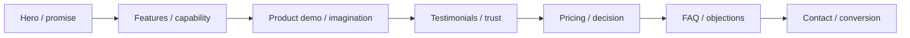
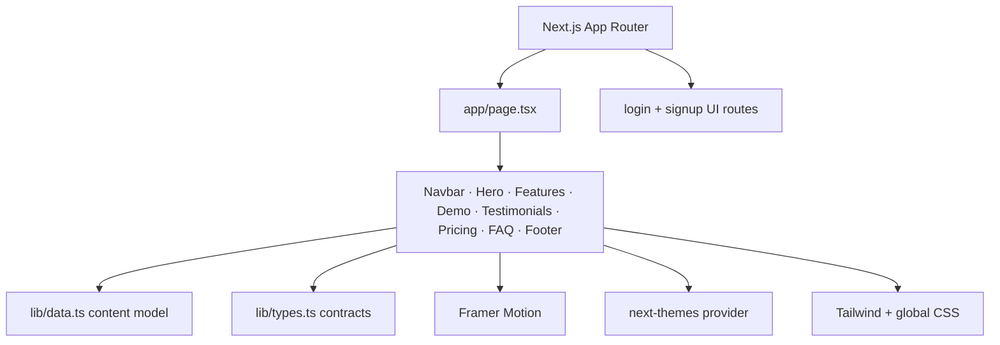

<div align="center">

# NOVAMIND AI

### A motion-led AI SaaS marketing prototype


**A polished front-end study in positioning, product storytelling, pricing, social proof, conversion, and responsive motion.**

[View the live concept](https://qb-novamind-ai.netlify.app)

</div>

## Opening frame

This is a genuine capture of the deployed NovaMind AI landing page.

[](https://qb-novamind-ai.netlify.app)

## The conversion narrative



The page is composed like an investor-ready product story: establish a category, describe four benefits, visualize the product, reduce perceived risk, present plan choices, answer objections, and offer a final contact path.

## Product-story system

| Layer | Repository implementation |
|---|---|
| Brand | `Logo`, navigation, gradients, glass surfaces, dark/light theme |
| Promise | Animated `Hero` with primary and secondary calls to action |
| Capability | Data-driven feature cards from `lib/data.ts` |
| Proof | Product demo and testimonial presentation |
| Commercial model | Starter, Pro, and Enterprise plan cards |
| Objection handling | Expandable FAQ content |
| Lead capture | Interactive contact form and modal system |
| Continuity | Footer navigation, socials, legal and resource groups |

## Front-end architecture



## Run the pitch locally

```bash
git clone https://github.com/QizarBilal/AI-Startup.git
cd AI-Startup
npm install
npm run dev
```

Open `http://localhost:3000`.

```bash
npm run lint
npm run build
npm start
```

## Content control room

Most reusable marketing content is centralized in `lib/data.ts`:

- navigation anchors;
- four feature propositions;
- testimonial records;
- three pricing plans;
- six FAQ entries;
- social and footer links.

That separation makes the interface easy to rebrand without rewriting section composition.

## Prototype disclosure

This repository is a marketing-interface prototype, not evidence of an operating AI platform. The pricing, API allowances, customer identities, testimonials, performance outcomes, certification statements, encryption claims, integrations, support levels, SLAs, and enterprise capabilities in the seed data should be treated as illustrative content unless independently implemented and verified.

Before using this publicly for a real company, replace every placeholder with supportable facts and working destinations. Login and signup screens are interface routes; production authentication requires a backend, secure sessions, account recovery, verification, rate limiting, and abuse controls.

## Launch review

- Verify every CTA, navigation anchor, social link, and footer destination.
- Confirm contact submissions reach a controlled backend and display error states.
- Replace illustrative testimonials with consented, attributable customer proof.
- Validate pricing against a functioning billing and entitlement system.
- Test reduced motion, keyboard focus, modal trapping, and FAQ semantics.
- Check theme hydration, mobile navigation, metadata, and social previews.
- Run performance, accessibility, and responsive audits before launch.

## Extension ideas

- Connect the contact form to a server action or CRM.
- Add a real authentication provider and protected dashboard.
- Replace demo visuals with product-derived screenshots or video.
- Generate structured metadata for software, FAQ, and pricing pages.
- Add product analytics with privacy-respecting consent.
- Introduce visual regression and end-to-end conversion tests.

## License

Released under the [MIT License](LICENSE).

<div align="center">

`POSITION → DEMONSTRATE → PROVE → CONVERT`

NovaMind AI is a front-end concept until the product claims behind it are built and verified.

</div>
